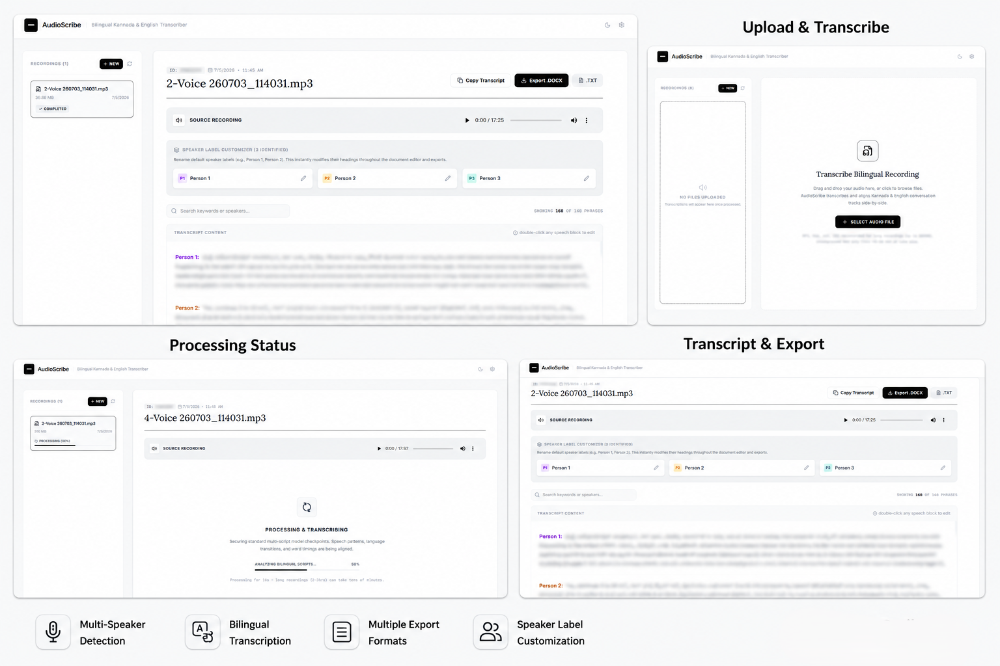

<div align="center">

# AudioScribe

[](https://react.dev/)
[](https://www.typescriptlang.org/)
[](https://tailwindcss.com/)
[](https://ai.google.dev/)
[](https://expressjs.com/)

Bilingual Kannada & English audio transcription with speaker-labeled editing and document export.

</div>

AudioScribe is a local-first web app for transcribing Kannada and English audio into editable, speaker-labeled transcripts. It uses Gemini for transcription, keeps job history in a local JSON file, and exports completed transcripts as text or Word-compatible documents.



> AudioScribe is intended for local and personal use. It is not production-hosting ready: there is no authentication, multi-user access control, rate limiting, hardened upload storage, or deployment security review.

## Features

- Kannada and English transcription with original scripts preserved
- Speaker-labeled transcript review and inline editing
- Speaker renaming across the full transcript
- Large audio uploads with chunking
- TXT and Word-compatible `.doc` export
- Light and dark themes
- Local settings panel for the Gemini API key

## Requirements

- Node.js 20 or newer
- A Gemini API key

## Local Setup

1. Install dependencies:

   ```sh
   npm install
   ```

2. Create `.env.local` from the example file:

   ```sh
   cp .env.example .env.local
   ```

3. Add your Gemini API key to `.env.local`:

   ```env
   GEMINI_API_KEY="your-key-here"
   ```

4. Start the local app:

   ```sh
   npm run dev
   ```

5. Open the app:

   ```text
   http://localhost:7420
   ```

## Local Data

AudioScribe writes runtime files locally:

- `.env.local` stores your Gemini API key
- `uploads/` stores uploaded audio
- `jobs.json` stores transcription job state

These files are ignored by Git and should not be committed.

## Known Limitations

- Chunked uploads are implemented, but the chunking and large-audio workflow still needs improvement. Very large files, interrupted uploads, retries, cleanup of stale chunks, and long-running transcription recovery should be hardened before relying on this for heavy use.
- AudioScribe is local-use software today, not a production-hosted service.

## Scripts

- `npm run dev` starts the local development server
- `npm run lint` runs the TypeScript check
- `npm run build` builds the frontend and server bundle
- `npm run start` runs the built server
- `npm run clean` removes generated runtime/build files

## Open Source Status

This repository is licensed under the MIT License. Contributions are welcome, but please treat the current app as a local-use tool rather than a secure hosted service.
